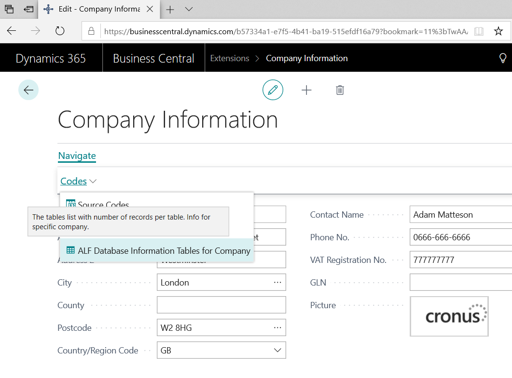

## ALF Database Information

> ALF Database Information - small feature that show the tables list with number of records per table. Info for specific company. New option add on 'Company Information' page.

Github project: <https://github.com/finn777/ALF_Database_Information>
 
Readme: <https://github.com/finn777/ALF_Database_Information/blob/master/readme.md>
 
.app file: <https://github.com/finn777/ALF_Database_Information/blob/master/AL/ALF_Database_Information/Alexey%20Finogenov_ALF_Database_Information_1.0.190220.2.app> 

App pictures -

